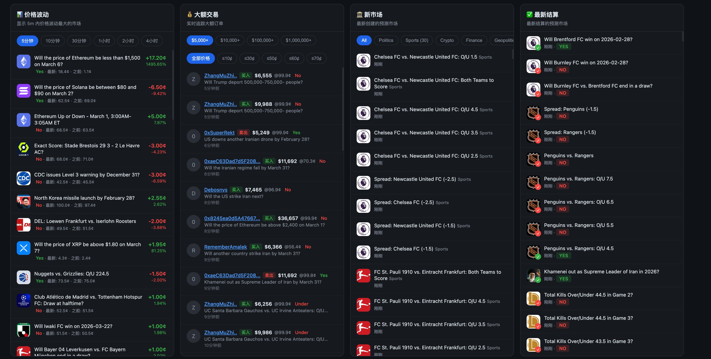

# Polyscan

Polymarket 实时监控工具 —— 追踪大额交易、价格异动、鲸鱼钱包，并通过 Telegram 推送告警，同时提供 Web Dashboard。



## 功能概览

| 功能 | 说明 |
|------|------|
| 🐋 大额交易监控 | WebSocket + REST 双通道实时检测超过阈值的交易 |
| 📈 价格异动检测 | 可配置的滑动窗口规则（如 5 分钟涨 5%、1 小时涨 15%） |
| 🔔 Telegram 告警 | 大额交易、价格飙升、鲸鱼动态实时推送 |
| 🦈 鲸鱼追踪 | 自动 / 手动追踪大额交易钱包，轮询其后续活动 |
| 📊 Web Dashboard | 四栏实时面板：价格波动、大额交易、新市场、最新结算 |
| 🗄️ SQLite 持久化 | 零依赖嵌入式数据库，交易/告警/鲸鱼/价格事件/结算全部落库 |

## 技术栈

- **语言**: Go 1.25+
- **Web 框架**: [Gin](https://github.com/gin-gonic/gin)
- **数据库**: SQLite（纯 Go 驱动 [modernc.org/sqlite](https://modernc.org/sqlite)，无 CGO）
- **WebSocket**: [nhooyr.io/websocket](https://github.com/nhooyr/websocket)
- **配置**: YAML (`gopkg.in/yaml.v3`)
- **前端**: 单页 HTML + 原生 JS + SSE 实时推送（无框架）

## 项目结构

```
polyscan/
├── cmd/
│   ├── polyscan/                # 主程序入口
│   │   └── main.go              # 组件编排、启动流程、优雅退出
│   ├── backfill-profiles/       # 用户名回填工具
│   │   └── main.go              # 通过 Data API 补全历史交易的 profile_name
│   └── migrate-mongo2sqlite/    # MongoDB → SQLite 迁移工具
│       └── main.go              # 一次性数据迁移
├── internal/
│   ├── api/                     # HTTP API 服务 (Gin)
│   │   └── server.go            # REST 端点 + SSE + 静态页面
│   ├── config/                  # 配置加载
│   │   └── config.go            # YAML → Config 结构体
│   ├── market/                  # 市场发现
│   │   └── discovery.go         # 定时同步 Gamma API 市场列表
│   ├── monitor/                 # 实时监控器
│   │   ├── large_trade.go       # 大额交易检测 (WS + REST)
│   │   └── price_spike.go       # 价格异动检测 (滑动窗口)
│   ├── notify/                  # 通知推送
│   │   └── telegram.go          # Telegram Bot API 发送
│   ├── poller/                  # REST 轮询器
│   │   ├── trade_poller.go      # 大额交易轮询 (WS 兜底)
│   │   └── whale_poller.go      # 鲸鱼活动轮询
│   ├── profile/                 # 用户名解析
│   │   └── profile.go           # Polymarket 用户名查询 + 缓存
│   ├── store/                   # SQLite 持久层
│   │   ├── sqlite.go            # 连接管理、Schema 创建 (WAL 模式)
│   │   ├── trades.go            # 交易记录 CRUD + 去重合并
│   │   ├── alerts.go            # 告警记录
│   │   ├── whales.go            # 鲸鱼钱包
│   │   ├── price_events.go      # 价格事件
│   │   └── settlements.go       # 结算记录
│   ├── types/                   # 共享类型定义
│   │   ├── alert.go             # 告警类型 + Telegram 格式化
│   │   ├── market.go            # 市场信息 + 内存缓存
│   │   ├── trade.go             # Data API 交易结构
│   │   ├── ws.go                # WebSocket 消息解析
│   │   └── price_mover.go       # Dashboard 价格波动 DTO
│   ├── whale/                   # 鲸鱼追踪器
│   │   └── tracker.go           # 内存缓存 + SQLite 持久化
│   └── ws/                      # WebSocket 客户端
│       └── client.go            # 自动重连、批量订阅、消息分发
├── web/
│   └── index.html               # Dashboard 单页面
├── data/                        # 运行时数据 (git ignored)
│   └── polyscan.db              # SQLite 数据库文件
├── config.yaml                  # 配置文件
├── hosts.mk                     # 服务器部署配置 (git ignored)
├── Makefile                     # 构建 & 部署命令
├── go.mod
└── go.sum
```

## 架构设计

```
                         ┌─────────────────────┐
                         │    Gamma API         │
                         │ (markets/events)     │
                         └──────────┬───────────┘
                                    │ 定时同步
                         ┌──────────▼───────────┐
                         │   Market Discovery   │
                         │  (内存 MarketStore)   │
                         └──────────┬───────────┘
                                    │ 新市场 → 动态订阅
     ┌──────────────────────────────┼──────────────────────────────┐
     │                              │                              │
     ▼                              ▼                              ▼
┌─────────┐                ┌──────────────┐               ┌──────────────┐
│ WS 客户端 │               │  Trade Poller │              │ Whale Poller │
│(实时行情) │               │  (REST 兜底)  │              │ (钱包轮询)    │
└────┬─────┘                └──────┬───────┘               └──────┬───────┘
     │                             │                              │
     │  last_trade_price           │  大额交易                     │  鲸鱼活动
     │  best_bid_ask               │                              │
     ▼                             ▼                              ▼
┌──────────────┐          ┌──────────────┐              ┌──────────────┐
│ Large Trade  │◄────────►│  去重 + 合并   │             │ Whale Tracker│
│   Monitor    │          │ (WS ↔ REST)  │             │  (自动/手动)  │
└──────┬───────┘          └──────────────┘              └──────┬───────┘
       │                                                       │
       │              ┌──────────────┐                         │
       │              │ Price Spike  │                         │
       │              │   Monitor    │                         │
       │              │ (滑动窗口)    │                         │
       │              └──────┬───────┘                         │
       │                     │                                 │
       ▼                     ▼                                 ▼
┌──────────────────────────────────────────────────────────────────┐
│                        Alert Channel                             │
└───────────────────────────┬──────────────────────────────────────┘
                            │
              ┌─────────────┼─────────────┐
              ▼                           ▼
     ┌──────────────┐           ┌──────────────┐
     │   Telegram    │           │   SQLite     │
     │  (Bot API)    │           │  (5 张表)     │
     └──────────────┘           └──────┬───────┘
                                       │
                                       ▼
                              ┌──────────────┐
                              │  HTTP API    │
                              │  (Gin :9090) │
                              └──────┬───────┘
                                     │ REST + SSE
                                     ▼
                              ┌──────────────┐
                              │  Dashboard   │
                              │  (单页 HTML)  │
                              └──────────────┘
```

### 数据流

1. **Market Discovery** 定时从 Gamma API 拉取所有活跃市场，写入内存 `MarketStore`，新发现的 asset 动态订阅到 WebSocket
2. **WebSocket Client** 接收 `last_trade_price`（交易）和 `best_bid_ask`（报价）两类事件，分发到不同 channel
3. **Large Trade Monitor** 消费交易事件，超阈值的交易：
   - 存入 SQLite（WS 来源）
   - 异步调用 Data API 补全钱包信息和用户名（enrichment）
   - 触发 Telegram 告警（受价格过滤）
4. **Trade Poller** 作为 WS 兜底，定时拉取 Data API 大额交易；与 WS 记录智能合并（`UpsertRESTTrade`）去重
5. **Price Spike Monitor** 维护每个 asset 的价格滑动窗口，检测异动并推送告警
6. **Whale Tracker** 收集大额交易钱包，`Whale Poller` 定时查询其最新活动并告警
7. **HTTP API** 聚合 SQLite 数据 + 内存状态，通过 REST 接口和 SSE 实时推送到 Dashboard

### 去重策略

| 场景 | 策略 |
|------|------|
| WS 重复事件 | `asset + timestamp` 组合去重，10 分钟后淘汰 |
| REST 重复交易 | `transaction_hash` 唯一索引 |
| WS ↔ REST 同一交易 | `UpsertRESTTrade`：按 `asset + size + timestamp±10s` 匹配，合并为 `ws+rest` |
| 价格异动冷却 | 同一 asset + 规则，冷却时间内不重复告警 |

## API 端点

| 方法 | 路径 | 说明 |
|------|------|------|
| GET | `/` | Dashboard 页面 |
| GET | `/api/health` | 健康检查 |
| GET | `/api/stats` | 聚合统计（市场/交易/告警/鲸鱼数量） |
| GET | `/api/trades?min_usd=&limit=` | 大额交易列表 |
| GET | `/api/trades/:wallet` | 指定钱包的交易 |
| GET | `/api/price-moves?window=&limit=` | 价格波动排行 |
| GET | `/api/new-markets?category=&limit=` | 新上市场 |
| GET | `/api/settlements?limit=` | 最新结算 |
| GET | `/api/whales` | 追踪中的鲸鱼列表 |
| GET | `/api/whales/:address` | 鲸鱼详情 + 交易记录 |
| GET | `/api/alerts?type=&limit=` | 告警记录 |
| GET | `/api/price-events?limit=` | 价格异动事件 |
| GET | `/api/markets` | 全部市场 |
| GET | `/api/sse` | SSE 实时事件流 |

## 快速开始

### 前置依赖

- Go 1.25+（仅本地开发/编译需要，服务器运行无需 Go）
- Telegram Bot Token（从 [@BotFather](https://t.me/BotFather) 获取）

### 本地运行

```bash
# 编辑配置
cp config.yaml.example config.yaml
vim config.yaml

# 编译 & 运行
make run

# 开发模式 (debug 日志)
make dev
```

### 服务器部署

```bash
# 1. 在本地交叉编译 Linux 二进制并同步到服务器
make rsync-g1          # 自动 build-linux + rsync

# 2. SSH 到服务器
make g1                # 自动连接 tmux 会话

# 3. 在服务器上运行（无需 Go 环境）
make run
```

### 配置说明

```yaml
proxy: "http://127.0.0.1:7890"  # HTTP 代理 (留空不使用)
sqlite_path: "data/polyscan.db" # SQLite 数据库路径

large_trade_threshold: 10000    # 大额交易阈值 (USD)
large_trade_max_price: 0.95     # Telegram 告警价格过滤 (仅低概率交易)
price_spike_rules:              # 价格异动规则
  - window: 5m
    percent: 5
trade_poll_interval: 30s        # REST 轮询间隔
market_sync_interval: 5m        # 市场同步间隔
```

> 所有超阈值交易都会存入数据库并在 Dashboard 展示，`large_trade_max_price` 仅控制 Telegram 是否推送。

### Makefile 命令

| 命令 | 说明 |
|------|------|
| `make build` | 编译本地二进制到 `build/` |
| `make build-linux` | 交叉编译 Linux amd64 二进制 |
| `make run` | 运行（有二进制直接跑，否则先编译） |
| `make dev` | 开发模式（debug 日志） |
| `make rsync-g1` | 编译 Linux + 同步到 g1 服务器 |
| `make g1` | SSH 连接 g1 (tmux) |
| `make fmt` | 格式化代码 |
| `make vet` | 静态检查 |
| `make test` | 运行测试 |
| `make clean` | 清理构建产物 |

## SQLite 表结构

| 表 | 说明 | 关键索引 |
|------|------|---------|
| `trades` | 交易记录 | `transaction_hash` (unique), `timestamp`, `proxy_wallet` |
| `alerts` | 告警记录 | `created_at`, `type` |
| `whales` | 鲸鱼钱包 | `address` (unique) |
| `price_events` | 价格异动事件 | `detected_at`, `asset_id` |
| `settlements` | 结算记录 | `condition_id` (unique), `resolved_at` |

数据库配置：WAL 模式、`busy_timeout=5000`、单连接、`foreign_keys=ON`。所有时间字段存储为 INTEGER（Unix 秒）。

### 辅助工具

| 工具 | 说明 |
|------|------|
| `build/backfill-profiles` | 回填历史交易的用户名（通过 Data API /activity 接口） |
| `build/migrate-mongo2sqlite` | 从 MongoDB 迁移数据到 SQLite（一次性） |

```bash
# 回填用户名
./build/backfill-profiles data/polyscan.db http://127.0.0.1:7890

# MongoDB 迁移 (一次性)
./build/migrate-mongo2sqlite --mongo "mongodb://localhost:27017/" --db polyscan --sqlite data/polyscan.db
```

## License

MIT
